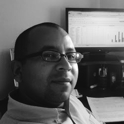

# About me

    
 Experienced Assistant Professor with a demonstrated history of working in the higher education industry. Skilled in Thermodynamics, Chemical reactor design, Analytical Skills, Aspen Hysys, and Numerical Simulation.

To improve my coaching skills, I got a Diploma in competency-based education, which allowed me to include several TIC tools in my teaching environment. Based on my knowledge of chemical process modeling, understanding in statistics and applied mathematics, my analytical, technical, programming skills, and my passion for converting data into actionable business opportunities, I started to study machine learning by myself.

Thus, I have been applying those tools to data-driven process modeling for control process solutions, primarily using Python, Aspen Hysys, and SQL.